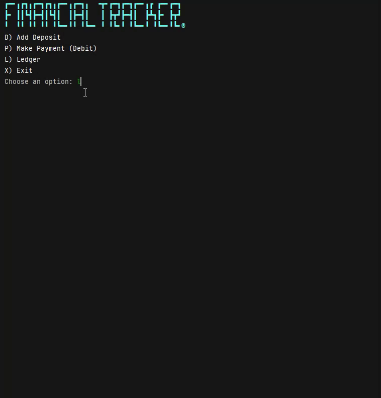

# Financial Tracker: Accounting Ledger Application

## Description 

Financial Tracker is a Java-based command-line application that assists users in tracking their financial transactions for personal & business use.
It supports adding new transactions, displaying them in ledgers, and filtering through multiple types of financial reports.

## User Stories

- As a user, I want my transactions to be saved & displayed accurately, so that I can view my deposits and payments later.
- As a user, I want my saved transactions to load as I start the application, so that I can view my current/previous payments & deposits.
- As a user, I want to record a new deposit, so that my transaction ledger reflects the money I've received.
- As a user, I want to record a new (debit) payment, so that my transaction ledger includes the money I've spent.
- As a user, I want to view all my transactions in one place, so that I can review my complete financial history.
- As a user, I want to exclusively view my deposits, so that I can review all the money I've received.
- As a user, I want to view only my payments, so that I can track all the money I've spent.
- As a user, I want to view transactions within a specific date range, so that I can review my financial activity during that period.
- As a user, I want to view all transactions based on a specific vendor, so that I can track my spending/income in relation to that vendor.
- As a user, I want to search for transactions using a combination of filters, so that I can easily find specific transactions without browsing through my entire ledger.

## Setup

Instructions on how to set up and run the project using IntelliJ IDEA:

### Prerequisites

- IntelliJ IDEA: Ensure you have IntelliJ IDEA installed, which you can download from [here](https://www.jetbrains.com/idea/download/).
- Java SDK: Make sure Java SDK is installed and configured in IntelliJ.

### Running the Application in IntelliJ

Follow these steps to get your application running within IntelliJ IDEA:

1. Open IntelliJ IDEA.
2. Select "Open" and navigate to the directory where you cloned or downloaded the project.
3. After the project opens, wait for IntelliJ to index the files and set up the project.
4. Find the main class with the `public static void main(String[] args)` method.
5. Right-click on the file and select 'Run 'YourMainClassName.main()'' to start the application.

## Technologies Used

- Java: Amazon Corretto 17.0.16

## Demo

## Future Work

- Exporting reports: save filtered or custom reports as a new file.
- Ledger Summary: show total deposits, total payments, and current balance.
- Modify transactions: edit or remove transactions without modifying the file directly.

## Resources

- [Potato Sensei - OpenAI: ChatGpt 5 LLM](https://chatgpt.com/g/g-681d378b0c90819197b16e49abe384ec-potato-sensei)
- [LocalDate (Java Platform SE 8 ) - Oracle Documentation](https://docs.oracle.com/javase/8/docs/api/java/time/LocalDate.html)
- [Java Comparator Interface - GeeksforGeeks](https://www.geeksforgeeks.org/java/java-comparator-interface/)

## Team Members

- **Natnael Tewolde:** Main Contributor

## Thanks

- Thank you to both *potato senseis* for your continuous support and guidance!
